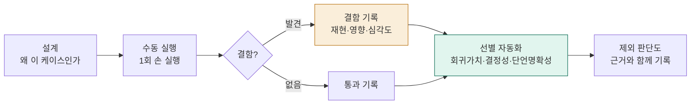

# QA / Test Engineer 포트폴리오 — 김정석

화면에 무엇이 떴는지가 아니라, 그 아래 시스템 상태와 데이터 흐름이 기댓값과 일치하는지를 검증합니다. 그리고 무엇을 자동화하고 무엇을 자동화하지 않을지까지 판단하는 것을 QA의 일로 봅니다.

> **3줄 요약**
> - **무엇을:** Medusa 헤드리스 커머스의 구매 여정 전반(탐색·장바구니·인증·세션)을 기능 검증
> - **무엇을 찾았나:** 결함 5건 — 비밀번호 정책 부재(Major)·품절 오표시(Major) 등, 유형이 다른 결함
> - **자동화·CI:** 테스트 16개 중 Playwright 자동화 11개 / GitHub Actions를 통한 워크플로 구조 검증

📄 **전체 포트폴리오 문서:** [PDF 보기](docs/Medusa_QA_포트폴리오_김정석.pdf) — 케이스·결함·계획 전문 수록

---

## 1. 프로젝트 개요

**대상:** Medusa 2.15.5 — 셀프호스팅 헤드리스 커머스(스토어프론트 + Admin).

**검증 범위:** 상품 탐색 → 장바구니 → 인증/세션에 이르는 사용자 구매 여정 전반을, 화면 동작이 아니라 데이터 정합성·상태 전이·보안 관점에서 검증했다. (금액 합산, 세션 생명주기, 계정 열거 방지, 입력 검증의 계층 비대칭 등)

**선정 이유:** 금액·재고·세션처럼 틀리면 매출과 신뢰에 직접 타격이 가는 도메인이라, 표면 너머의 정합성을 검증하는 관점을 보여주기에 적합하다.

**수행 범위:** 테스트 계획부터 케이스 설계(16건) · 수동 실행 · 결함 리포트(5건) · 자동화 테스트(11개) 선별 구현까지 전 과정을 단독 수행. 설계자·실행자·자동화 엔지니어 역할을 분리해 각 단계 산출물을 남겼다.

상세: 검증 범위·환경·심각도 기준은 [테스트 계획서](docs/Medusa_QA_테스트계획서_v1_1.pdf) 참조.

## 2. 나의 테스트 관점

테스트는 "버그 찾기"가 아니라 "리스크를 줄이는 판단"이라고 본다. 모든 것을 동등하게 검증할 수는 없으므로, 어디가 틀리면 가장 크게 깨지는지를 먼저 정하고 거기에 검증을 집중했다.

**① 리스크 기반 우선순위** — 금액·재고·인증처럼 틀리면 회복 불가능하거나 매출·신뢰에 직접 타격인 지점을 High로 두고 먼저 검증했다. 예: 장바구니 합계 재계산(CART), 세션 생명주기(SESSION), 비밀번호 정책(DEF-03)은 High, 표기·정렬 수준은 Med 이하.

**② 표면이 아니라 상태를 검증** — "화면에 떴는가"가 아니라 "그 아래 시스템 상태·데이터가 기댓값과 일치하는가"를 단언 기준으로 삼았다. 그래서 옵션 미선택을 품절로 표시하는 것(DEF-04), 프론트 통과 값이 Admin까지 영속되는 것(ADMIN-01)처럼 화면만 봐서는 안 보이는 결함을 잡았다.

**③ 종료 기준 (Go/No-Go)** — "테스트를 어디까지 하면 끝인가"를 사전에 정의했다. 미해결 Blocker 0건 + 설계 케이스의 기대 결과 충족을 합격선으로 두고, 그 기준으로 현재 상태를 판정한다.

**④ 자동화는 개수가 아니라 선별** — 회귀가치·결과 결정성·단언 명확성 세 기준으로 자동화 대상을 골랐고, 기준에 못 미치는 것은 근거를 들어 제외했다. (상세: 5장)

## 3. 검증 프로세스 한눈에

자동화를 먼저 짜지 않고, **설계 → 수동 실행 → 결함 기록 → 선별 자동화** 순서를 엄격히 지켰다. 검증 설계의 사고 과정과 결함 발견 경위를 산출물로 남기기 위해서다.

*설계 → 수동 실행 → (결함 발견 시) 결함 리포트 → 선별 자동화. 자동화하지 않기로 한 판단도 근거와 함께 남긴다.*

### 산출물 지도

| 산출물 | 내용 | 규모 |
|---|---|---|
| 테스트 계획서 | 범위·환경·심각도 기준·합격 기준 | 1부 |
| 케이스 명세서 | 11필드(설계 의도 포함) 케이스 | 16건 |
| 결함 리포트 | 재현·영향·심각도 | 5건 |
| 자동화 스크립트 | Playwright, spec 7파일 | 자동화 테스트 11개 |

*케이스 명세서·결함 리포트 전문은 [포트폴리오 PDF](docs/Medusa_QA_포트폴리오_김정석.pdf)에 수록. 전 산출물은 설계 의도 → 실행 결과 → (결함 시) 리포트로 추적 가능하게 연결돼 있다.*

## 4. 핵심 결함 요약

발견한 결함 5건. 각 결함은 *현상*이 아니라 *서비스·데이터에 미치는 영향*을 기준으로 서술하고 심각도를 매겼다. 상세 재현 절차는 [포트폴리오 PDF](docs/Medusa_QA_포트폴리오_김정석.pdf) 부록 A 참조.

| ID | 결함 | 영향 | 심각도 |
|---|---|---|---|
| DEF-01 | 전화번호 입력 검증 부재 | 비정상 연락처가 고객 DB에 영속 저장 → 배송·CS 지장, Admin UI 깨짐 | Minor |
| DEF-02 | 수량 드롭다운 옵션값 중복 | 옵션 생성 로직의 경계 처리(off-by-one) 의심 신호. 기능 영향은 없음 | Minor |
| DEF-03 | 비밀번호 최소 길이 정책 부재 | 1글자 비밀번호로 계정 생성·로그인 가능 → brute-force 취약, 계정 탈취 위험 | **Major** |
| DEF-04 | 옵션 미선택 시 "Out of stock" 오표시 | 판매 가능 상품을 품절로 오인 → 구매 이탈, 매출 직결 | **Major** |
| DEF-05 | 중복 가입 응답으로 계정 존재 여부 노출 | 등록된 이메일을 외부에서 식별 가능(계정 열거) → 표적 피싱 사전정보 악용 여지. 가입 폼 특성상 위험도는 낮음 | Minor |

결함의 결을 다양하게 보았다: 있어야 할 것이 없음(DEF-03 정책 부재), 없는 것을 있다고 표시(DEF-04 오표시), 막긴 하되 정보를 흘림(DEF-05 계정 열거) — 단순 기능 버그가 아니라 유형이 다른 결함을 잡았다. 특히 DEF-05는 보안 리스크를 과장하지 않고 가입 폼의 트레이드오프를 함께 기록해, 맥락에 따라 심각도를 조정하는 판단을 보였다.

## 5. 자동화 판단

자동화는 **개수가 목표가 아니다.** 16개 케이스를 모두 수동 실행한 뒤, 세 기준으로 자동화 여부를 갈랐다.

**선별 기준**
- **회귀가치** — 핵심 경로(금액·인증·세션)에 있어 반복적으로 지켜야 하는가
- **결과 결정성** — 외부 의존·랜덤 없이 동일 입력에 동일 결과인가
- **단언 명확성** — 기댓값과의 일치를 코드로 정밀하게 표현할 수 있는가

### 자동화한 것

금액 재계산(CART), 정렬·격리(BROWSE), 세션 생명주기(SESSION), 입력 검증(AUTH/REGISTER), 가격 일관성(DETAIL) 등 회귀가치가 높고 단언이 명확한 케이스. 특히 **단언을 "화면이 떴는가"가 아니라 "기댓값과 일치하는가"로** 작성했다.
- 예) 정렬: 화면 가격 배열이 *정렬된 배열과 동일한지* 비교 (`prices == sorted(prices)`)
- 예) 삭제 재계산: 시간을 기다리지 않고 *소계가 20→10으로 바뀔 때까지* 상태 변화를 대기

### 자동화하지 않은 것 (근거와 함께)

| 케이스 | 제외 근거 |
|---|---|
| TC-CART-03 (빈 카트 차단) | 라우팅 구조상 결정되어 회귀가치 낮음. 현재 404 차단이 *개선 여지*가 있어, 자동화로 고정하면 향후 UX 개선을 방해 |
| TC-SESSION-03 (보호 페이지 직접 접근) | CART-03과 동일한 차단 패턴이라 회귀가치 중복. 인증 가드는 SESSION-01·02가 이미 커버 |
| TC-ADMIN-01 (검증 비대칭) | Admin 인증 + 선행 가입에 의존해 독립 실행 어려움. *구조적 통찰*을 보이는 케이스라 수동+증거가 적합 |
| TC-CHECKOUT-01 (전화번호 검증) | 의미 있는 검증(DB 영속 확인)에 Admin 경로 필요. 회귀 빈도 낮아 비용 대비 효용 낮음 |
| DEF-02 (드롭다운 중복) | 기능 영향 없는 UI 무결성 결함이라 회귀가치 미달. 수동 확인으로 충분 |

### 결함을 회귀 가드로 박제

일부 자동화는 **의도적으로 FAIL하도록** 작성했다. DEF-04(품절 오표시), DEF-03(비번 정책 부재)은 *올바른 동작*을 단언하므로 현재는 실패하며, 이 실패가 곧 결함이 살아있다는 증거다. 결함이 수정되면 자동으로 통과로 바뀌어 회귀를 감지한다.

## 6. 협업·품질 확장 관점

이 프로젝트는 1인 검증이지만, **결함을 "전달 가능한 형태"로 남기는 것**을 협업의 출발점으로 보았다.

**개발자가 즉시 재현·수정할 수 있는 결함 리포트** — 모든 결함을 재현 절차·기대 vs 실제·영향·심각도 형식으로 작성했다. "화면이 깨진다"가 아니라 "어떤 조건에서, 무엇이, 왜 문제인가"를 담아 개발자가 바로 이슈로 받을 수 있게 했다.

**단순 보고가 아닌 개선 제안** — 결함이 아닌 것도 더 나은 동작을 제안했다. 예: 빈 카트·보호 페이지 직접 접근 시 404 대신 안내 페이지로 리다이렉트하는 편이 UX상 낫다(Trivial 개선 제안). 또 DEF-05(계정 열거)는 보안 리스크를 과장하지 않고, 회원가입 폼의 트레이드오프를 함께 기록해 *맥락에 맞는 우선순위*를 제안했다.

**검증을 데이터 흐름 전체로 확장** — 화면 단위가 아니라, 프론트에서 통과한 입력이 Admin·DB까지 어떻게 영속되는지(TC-ADMIN-01 검증 비대칭)를 추적했다. 단일 화면 너머 시스템 경계를 보는 관점이다.

## 7. 한계와 성장 방향

이 포트폴리오의 한계를 명확히 인지하고 있으며, 한계를 아는 것 또한 검증자의 역량이라고 본다.

**인지한 한계**
- **CI 환경 제약** — GitHub Actions가 로컬 Medusa 인스턴스에 접속할 수 없어, 풀 E2E 회귀를 CI에서 자동 실행하지는 못한다. 대신 워크플로 문법·구조 검증까지 구성했다.
- **테스트 데이터 제약** — 시드 환경의 전 상품 재고가 충분해, *실제 품절* 상태의 검증은 환경상 재현하지 못했다. (옵션 미선택의 품절 오표시 DEF-04는 별개로 확인.)
- **검증 범위** — 결제 PG 연동·성능·크로스 브라우저는 의도적으로 범위에서 제외했다. 기능 정합성에 집중하기 위한 선택이며, 확장 시 우선 보강 영역이다.

**강화하고 싶은 방향**
- 단위·통합 레벨의 화이트박스 검증과 E2E를 잇는 *테스트 피라미드 전반*의 설계 역량
- 테스트 설계 기법의 체계화 (ISTQB CTAL 학습 중)
- CI/CD 파이프라인 위에서 회귀 스위트가 실제로 도는 환경 구축

**지향점** — 결함을 많이 찾는 테스터를 넘어, *어디를 검증하지 않아도 되는지까지 판단해 품질 비용을 최적화하는* QA 엔지니어를 지향한다.

## 8. 테스트 케이스 실행 결과

| TC-ID | 제목 | 우선순위 | 자동화 | 실행 결과 |
| :--- | :--- | :---: | :---: | :--- |
| TC-BROWSE-01 | 상점 가격 정렬 정확성 | Med | O | Pass |
| TC-BROWSE-02 | 카테고리 상품 격리 | Med | O | Pass |
| TC-CART-02 | 수량 변경 합계 재계산 | High | O | Pass |
| TC-CART-03 | 빈 카트 체크아웃 차단 | Med | X | Pass(관찰) |
| TC-CART-04 | 다중 상품 소계 합산 | High | O | Pass |
| TC-CART-05 | 항목 삭제 후 재계산 | High | O | Pass |
| TC-CHECKOUT-01 | 전화번호 입력 검증 | Low~Med | X | Fail → DEF-01 |
| TC-AUTH-01 | 로그인 에러 메시지 일관성 | High | O | Pass |
| TC-AUTH-02 | 회원가입 입력 검증 | High | O | Fail → DEF-03 |
| TC-AUTH-03 | 중복 이메일 가입 차단 | Med | O | 부분 Fail → DEF-05 |
| TC-ADMIN-01 | 검증 비대칭(Admin 영속) | Med | X | Fail → DEF-01 |
| TC-SESSION-01 | 세션 페이지 이동 지속성 | High | O | Pass |
| TC-SESSION-02 | 로그아웃 세션 종료 | High | O | Pass |
| TC-SESSION-03 | 보호 페이지 직접 접근 차단 | Med | X | Pass(관찰) |
| TC-DETAIL-01 | 옵션 미선택 품절 오표시 | High | O | Fail → DEF-04 |
| TC-DETAIL-02 | 목록·상세 가격 일관성 | Med | O | Pass |